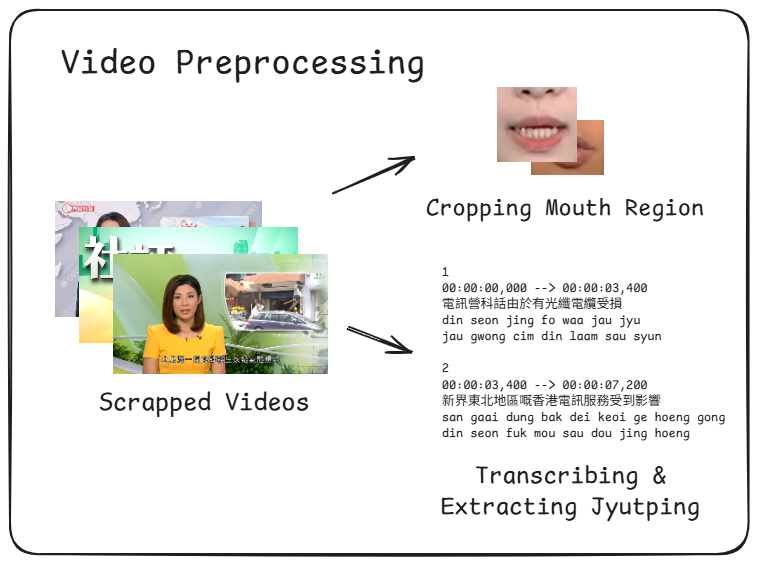
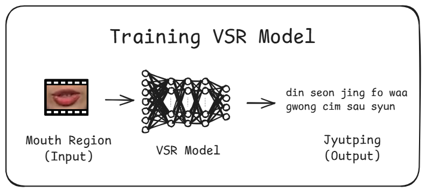
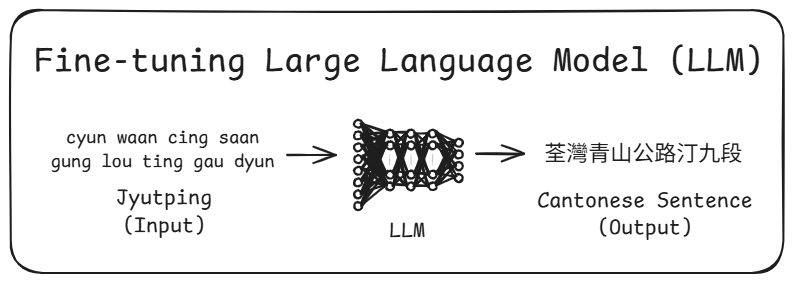

# Lip-Reading Model In Cantonese

### Model Evaluation

Please check this [Jupyter Notebook](https://github.com/ikwbb/Lip-Reading-Model-In-Cantonese/blob/main/Step_5_Model_Evaluation/testing_results/full/Model%20Evaluation.ipynb) for detailed model evaluation results.

---

### Code Implementation

This repository presents a complete pipeline for building a Cantonese lip-reading system. The project is organized into five main stages, each of which is contained within a corresponding folder:

1. `Step_1_News_Videos_Scraping`
2. `Step_2_News_Videos_Preprocessing`
3. `Step_3_Visual_Speech_Recognition_Model_Training`
4. `Step_4_Large_Language_Model_Fine_Tuning`
5. `Step_5_Model_Evaluation`

Please navigate through each folder in sequence to explore the full workflow.

------

### Step 1: News Videos Scraping

This step provides the code used to scrape news videos from TVB and iCable. The videos serve as the primary dataset for subsequent processing and training.

------

### Step 2: News Videos Preprocessing

In this step, the scraped news videos are preprocessed to extract the mouth region of interest (ROI) and align the corresponding transcription. This forms the foundation for the visual speech recognition stage.

------

### Step 3: Visual Speech Recognition (VSR) Model Training

This stage contains the training pipeline for the Visual Speech Recognition model, which maps the mouth ROI sequences to toneless Jyutping sequences representing spoken Cantonese.

------

### Step 4: Large Language Model (LLM) Fine-Tuning

Here, a Large Language Model is fine-tuned to convert the output Jyutping sequences from the VSR model into fluent Cantonese sentences.

------

### Step 5: Model Evaluation

This section includes all testing scripts and evaluation results. It demonstrates the final system’s performance and provides insights into model accuracy and areas for improvement.
